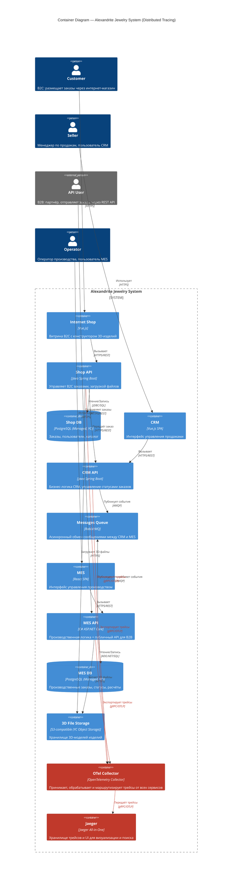

# C4 Container Diagram — Alexandrite (Distributed Tracing)

Новые компоненты и связи выделены **красным**.

```mermaid
C4Container
    title Container Diagram — Alexandrite Jewelry System (Distributed Tracing)

    Person(customer, "Customer", "B2C: размещает заказы через интернет-магазин")
    Person(seller, "Seller", "Менеджер по продажам, пользователь CRM")
    Person_Ext(apiUser, "API User", "B2B: партнёр, отправляет заказы через REST API")
    Person(operator, "Operator", "Оператор производства, пользователь MES")

    System_Boundary(sb, "Alexandrite Jewelry System") {

        Container(shop, "Internet Shop", "Vue.js", "Витрина B2C с конструктором 3D-изделий")
        Container(shopApi, "Shop API", "Java Spring Boot", "Управляет B2C заказами, загрузкой файлов")
        ContainerDb(shopDb, "Shop DB", "PostgreSQL (Managed, YC)", "Заказы, пользователи, каталог")

        Container(crm, "CRM", "Vue.js SPA", "Интерфейс управления продажами")
        Container(crmApi, "CRM API", "Java Spring Boot", "Бизнес-логика CRM, управление статусами заказов")

        Container(queue, "Messages Queue", "RabbitMQ", "Асинхронный обмен сообщениями между CRM и MES")

        Container(mes, "MES", "React SPA", "Интерфейс управления производством")
        Container(mesApi, "MES API", "C# ASP.NET Core", "Производственная логика + публичный API для B2B")
        ContainerDb(mesDb, "MES DB", "PostgreSQL (Managed, YC)", "Производственные заказы, статусы, расчёты")

        Container(fileStorage, "3D File Storage", "S3-compatible (YC Object Storage)", "Хранилище 3D-моделей изделий")

        Container(otelCollector, "OTel Collector", "OpenTelemetry Collector", "Принимает, обрабатывает и маршрутизирует трейсы от всех сервисов")
        Container(jaeger, "Jaeger", "Jaeger All-in-One", "Хранилище трейсов и UI для визуализации и поиска")
    }

    Rel(customer, shop, "Использует", "HTTPS")
    Rel(seller, crm, "Использует", "HTTPS")
    Rel(apiUser, mesApi, "Отправляет заказы", "HTTPS/REST")
    Rel(operator, mes, "Использует", "HTTPS")

    Rel(shop, shopApi, "Вызывает", "HTTPS/REST")
    Rel(shopApi, shopDb, "Чтение/Запись", "JDBC/SQL")
    Rel(shopApi, fileStorage, "Загружает 3D-файлы", "HTTPS")
    Rel(shopApi, crmApi, "Передаёт заказ", "HTTPS/REST")

    Rel(crm, crmApi, "Вызывает", "HTTPS/REST")
    Rel(crmApi, queue, "Публикует события", "AMQP")
    Rel(mesApi, queue, "Публикует / потребляет события", "AMQP")

    Rel(mes, mesApi, "Вызывает", "HTTPS/REST")
    Rel(mesApi, mesDb, "Чтение/Запись", "ADO.NET/SQL")
    Rel(mesApi, fileStorage, "Читает 3D-файлы", "HTTPS")

    Rel(shopApi, otelCollector, "Экспортирует трейсы", "gRPC/OTLP")
    Rel(crmApi, otelCollector, "Экспортирует трейсы", "gRPC/OTLP")
    Rel(mesApi, otelCollector, "Экспортирует трейсы", "gRPC/OTLP")
    Rel(otelCollector, jaeger, "Передаёт трейсы", "gRPC/OTLP")

    UpdateElementStyle(otelCollector, $bgColor="#c0392b", $fontColor="white", $borderColor="#922b21")
    UpdateElementStyle(jaeger, $bgColor="#c0392b", $fontColor="white", $borderColor="#922b21")
    UpdateRelStyle(shopApi, otelCollector, $textColor="#c0392b", $lineColor="#c0392b")
    UpdateRelStyle(crmApi, otelCollector, $textColor="#c0392b", $lineColor="#c0392b")
    UpdateRelStyle(mesApi, otelCollector, $textColor="#c0392b", $lineColor="#c0392b")
    UpdateRelStyle(otelCollector, jaeger, $textColor="#c0392b", $lineColor="#c0392b")
```
