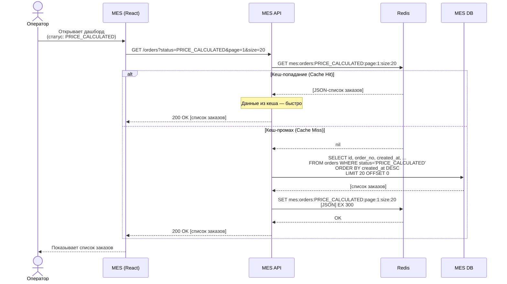
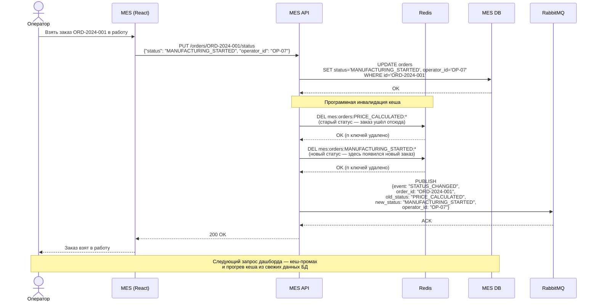
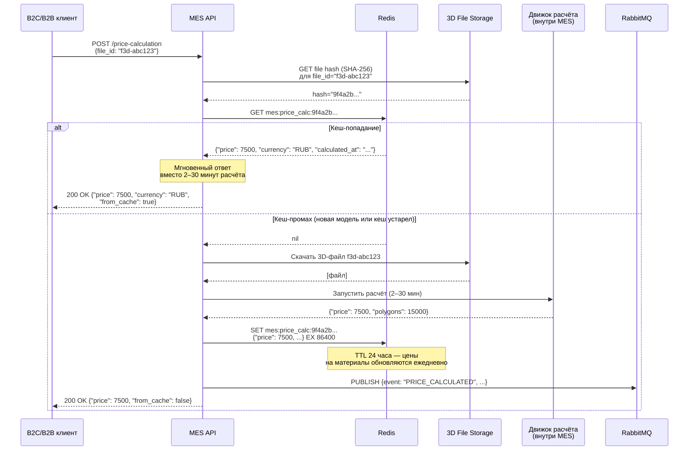

# Архитектурное решение по кешированию

## Мотивация

MES-система испытывает две связанных, но независимых проблемы с производительностью.

**Первая: медленная загрузка дашборда операторов.** Страница со списком заказов тормозит даже после введения фильтрации по статусам и пагинации. Дашборд открывают все операторы одновременно в начале рабочей смены. Каждый их запрос идёт в единственный инстанс MES DB — тот же, который в этот момент принимает записи о смене статусов и новых заказах. В результате чтение и запись конкурируют за один инстанс, и latency растёт.

**Вторая: высокое время ответа на запрос о расчёте стоимости.** Расчёт занимает от 2 до 30 минут. Если клиент (B2C или B2B) повторно отправляет ту же 3D-модель (итерации дизайна, повторные заказы того же изделия), MES запускает расчёт заново, хотя результат уже известен.

**Что планируем кешировать:**

1. **Список заказов по статусам для дашборда MES** (приоритет — высокий). Именно здесь жалуются операторы. Запрос «дай мне все заказы в статусе PRICE_CALCULATED» — детерминированный и повторяемый. Его результат меняется только когда меняется статус какого-либо заказа.

2. **Результаты расчёта стоимости** (приоритет — средний). Цена изделия привязана к конкретному файлу 3D-модели и текущим ценам на материалы. Если тот же файл отправлен повторно, можно вернуть кешированный результат.

**Почему именно серверное кеширование, а не клиентское:**

Клиентское кеширование (HTTP `Cache-Control`, `ETag`) решает задачу «не грузить данные, которые уже есть в браузере». Это не поможет в нашем случае:

- Разные операторы на разных рабочих местах. Кеш одного оператора не разгружает базу от запросов другого.
- Операторам нужны свежие данные в режиме реального времени: они конкурируют за заказы (кто первый возьмёт — тот получит оплату). Клиентский кеш показывал бы каждому оператору его личное устаревшее состояние.
- Серверный кеш один на всех: первый оператор, открывший дашборд, «прогревает» кеш для всех остальных.

---

## Предлагаемое решение

Рассматриваю два варианта серверного кеширования, которые решают проблему по-разному.

---

### Решение 1: Кеш страниц (page-level cache)

**Описание:** Кешируем готовый результат запроса целиком: «список заказов для страницы N с фильтром по статусу S». Ключ кеша включает статус, номер страницы и размер страницы. При записи (изменении статуса заказа) инвалидируем всё содержимое кеша для задетых статусов.

**Паттерн: Cache-Aside (Lazy Loading)**

Приложение само управляет кешем. При чтении:
1. Проверить Redis
2. Если промах — запросить БД, сохранить в Redis, вернуть клиенту
3. Если попадание — вернуть из Redis

При записи (изменение статуса):
1. Обновить БД
2. Удалить из Redis все ключи задетых статусов

**Почему Cache-Aside, а не Write-Through:**
Write-Through означает: при каждой записи в БД — одновременно обновить кеш. Проблема в том, что при изменении статуса одного заказа затрагиваются потенциально все страницы двух статусов (старого и нового). Нужно пересчитать и обновить все страницы обоих статусов при каждой операции записи. Это сложно и медленно. Cache-Aside позволяет просто удалить устаревшие ключи — и кеш обновится сам при следующем запросе.

**Почему не Refresh-Ahead:**
Refresh-Ahead хорошо работает, когда мы заранее знаем, что данные будут запрошены (предсказуемый паттерн доступа). В нашем случае операторы могут запрашивать любую комбинацию статус + страница + фильтр. Refresh-Ahead приводит к тому, что мы обновляем записи кеша, которые никто не запросит — тратим ресурсы впустую.

**Стратегия инвалидации: программная (event-based) + TTL как страховка**

Программная инвалидация: при любом изменении статуса заказа MES API выполняет:
```
DEL mes:orders:{old_status}:*
DEL mes:orders:{new_status}:*
```

TTL как страховка: каждый ключ создаётся с `EX 300` (5 минут). Если баг в коде инвалидации пропустит сброс — кеш всё равно обновится максимум через 5 минут.

**Почему не чистый TTL:** Операторы конкурируют за заказы в реальном времени. Если TTL = 5 минут, оператор может не увидеть доступный заказ до 5 минут после его появления. Это напрямую влияет на вознаграждение. Стандарт для критических данных — программная инвалидация при изменении, TTL только как резервная сеть.

**Ключи кеша:**
- `mes:orders:{status}:page:{n}:size:{page_size}` → JSON-список заказов
- `mes:price_calc:{file_hash}` → JSON с рассчитанной стоимостью, EX 86400 (24 часа)

---

### Решение 2: Кеш объектов + индексы на статусы (Redis Sorted Sets)

**Описание:** Кешируем отдельно каждый объект заказа и отдельно — индексы заказов по статусам. Индекс — это Redis Sorted Set (ZSET) с ключом `mes:status:{status}` и score = `created_at` timestamp. Пагинация реализуется через `ZRANGE ... BYSCORE` или `ZREVRANGE`.

При чтении страницы:
1. `ZREVRANGE mes:status:PRICE_CALCULATED 0 19` → список order_id
2. `MGET order:{id1} order:{id2} ...` → детали каждого заказа (pipeline)

При изменении статуса:
1. Обновить БД
2. `ZREM mes:status:{old_status} {order_id}`
3. `ZADD mes:status:{new_status} {timestamp} {order_id}`
4. `SET order:{id} {новые данные заказа}`

**Преимущество:** Изменение статуса одного заказа инвалидирует только один order_id — не весь список. Нет проблемы с пагинацией.

**Недостаток:** Более сложная реализация. Требует двух обращений к Redis на каждый запрос (ZRANGE + MGET). Нужно тщательно синхронизировать состояние Redis и БД.

---

### Сравнительная таблица решений

| | Решение 1 (page-level cache) | Решение 2 (объекты + ZSET-индексы) |
|--|------------------------------|-------------------------------------|
| **Описание** | Кешируем готовые страницы с результатами запросов по статусу | Кешируем отдельные объекты заказов + Redis Sorted Sets как индексы по статусу |
| **Паттерн** | Cache-Aside: читаем из кеша, при промахе — из БД | Cache-Aside для объектов + Write-Through для индексов |
| **Инвалидация** | При изменении статуса: удалить все страницы обоих задетых статусов | При изменении статуса: ZREM/ZADD в индексах + SET для объекта заказа |
| **Плюсы** | Простота реализации. Один ключ = один запрос. Быстрый старт | Тонкая инвалидация: одно изменение не сносит весь список. Данные всегда актуальны на уровне отдельного заказа |
| **Минусы** | При изменении любого заказа в статусе — удаляем все страницы этого статуса. Первый запрос после инвалидации всегда идёт в БД («thundering herd» при одновременном старте смены) | Сложнее реализовывать и тестировать. Два обращения к Redis на каждое чтение. Риск рассинхронизации индексов при ошибках |
| **Сложность реализации** | Низкая — несколько строк кода | Высокая — нужно аккуратно поддерживать ZSET-индексы |
| **Нагрузка на БД** | После инвалидации — один «холодный» запрос прогревает кеш для всех | После инвалидации — данные в Redis актуальны сразу, без «холодного» старта |
| **Подходит, если** | Команда небольшая, нужен быстрый результат | Операторов много, заказы меняются часто, нельзя допускать даже кратковременный «cold start» |

**Заключение:** Рекомендую **Решение 1** для первой итерации. Текущая команда и так перегружена приоритетными задачами. Решение 1 реализуется за один спринт, решает 90% проблемы и даёт понятную точку расширения. Решение 2 имеет смысл как следующий шаг — когда появятся ресурсы и когда данные покажут, что Решение 1 уже не справляется (например, операторов станет значительно больше и thundering herd на старте смены станет заметной проблемой).

---

### Диаграммы последовательности

#### Сценарий 1: Чтение списка заказов (операторский дашборд)



#### Сценарий 2: Изменение статуса заказа + инвалидация кеша



#### Сценарий 3: Расчёт стоимости с кешированием результата



---

### Технология: Redis

**Redis** — выбор по умолчанию для серверного кеша в 2024 году. Обоснование:

- Работает в памяти, latency < 1 мс
- Поддерживает `DEL` по паттерну (`SCAN` + `DEL`) для инвалидации по префиксу
- Поддерживает TTL нативно (`EX`, `EXPIRE`)
- Yandex Cloud предоставляет **Managed Service for Redis** — managed инстанс без операционных накладных расходов для единственного DevOps-инженера
- Если в будущем перейдём к Решению 2 — Redis поддерживает Sorted Sets из коробки

**Конфигурация:**
- Отдельный Redis-инстанс для кеша (не совмещать с очередями или сессиями — разные паттерны нагрузки и политики вытеснения)
- Политика вытеснения: `allkeys-lru` (при нехватке памяти вытесняются наименее используемые ключи — безопасно для кеша)
- Persistence: `no` (кеш пересоздаётся при перезапуске; нет смысла хранить кеш на диске)
- Память: для текущего масштаба достаточно 256 МБ–1 ГБ

---

### Итоговая схема компонентов

```
Оператор → MES (React) → MES API → Redis (Cache-Aside)
                                  ↓ (промах)
                                MES DB
```

При изменении статуса:
```
MES API → MES DB (write)
        → Redis DEL (инвалидация кеша)
        → RabbitMQ (уведомление других сервисов)
```
